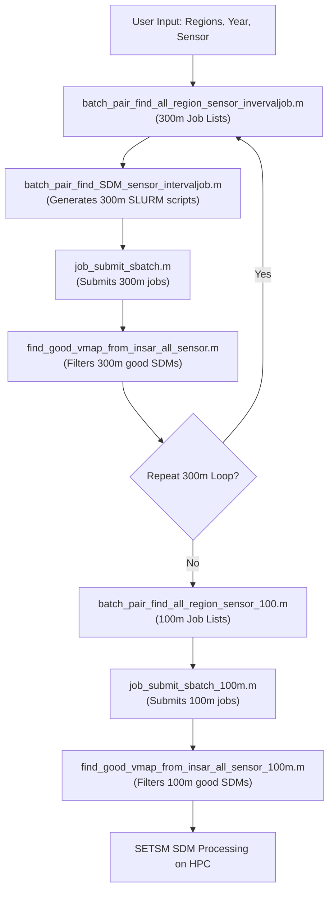

# SDM Workflow Architecture Diagram

## Overview
- **300m Workflow**: Iterative loop for quality filtering of SDM pairs.
- **100m Workflow**: Final processing at target resolution using good pairs.
- All scripts are in `matfiles/`, with outputs to `jobs/` and HPC paths.